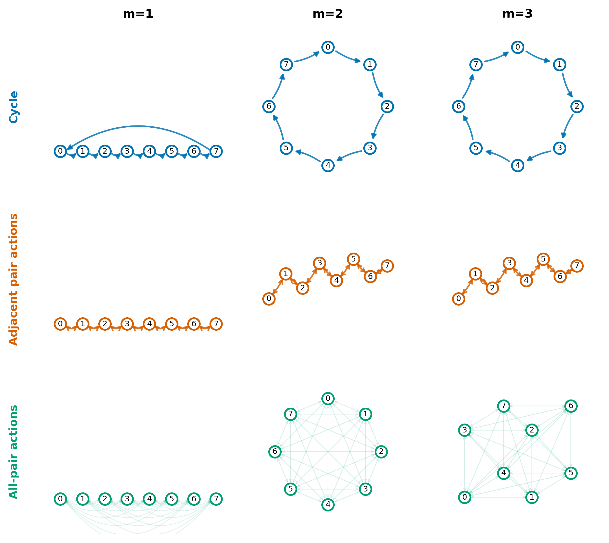
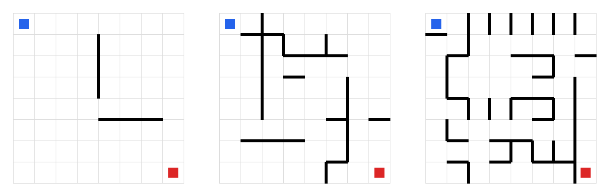
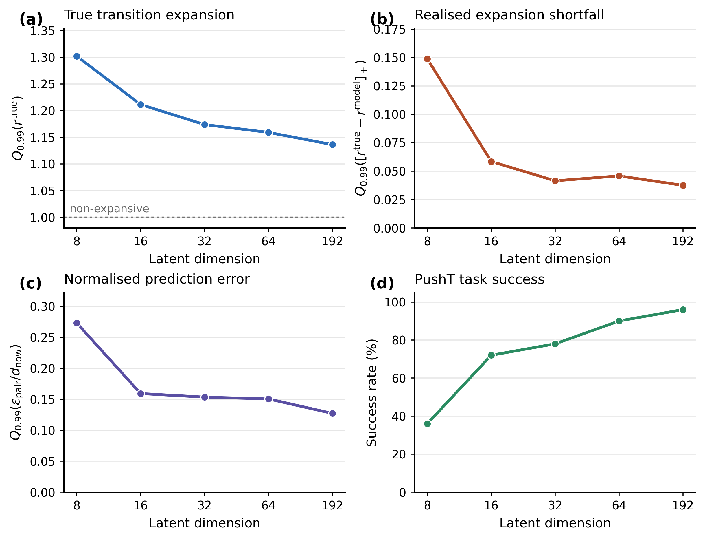

# Predictive-Realization Dimension Experiments

This repository collects the experiments behind a paper/project on **predictive-realization dimension**: once the sufficient state has already been fixed, how many Euclidean latent dimensions are still needed to realize the dynamics with a prescribed regularity? 🧭

Existing latent-dimension arguments often ask

```text
What information must a representation preserve?
```

This project separates that question from a second one:

```text
Given a sufficient state, how many Euclidean coordinates are needed so that
all action-conditioned dynamics can be implemented with bounded expansion?
```

The central object studied here is

```math
d_{\mathrm{PR}}(T;L)
= \min \left\{
m :
\exists \phi:\mathcal X \hookrightarrow \mathbb R^m,\;
\Lambda_T(\phi) \le L
\right\},
```

where

```math
\Lambda_T(\phi)
=
\sup_{a,\;x\ne y}
\frac{
\|\phi(T_a(x))-\phi(T_a(y))\|
}{
\|\phi(x)-\phi(y)\|
}.
```

The guiding insight is simple but easy to miss:

```text
Each action imposes regularity constraints, but all actions must share one
latent geometry.
```

So the repository is not only a polished final-paper artifact. It is also a research record: finite systems, maze certificates, learned maze world models, LeWorldModel-based diagnostics, latent-flow prototypes, negative controls, ablations, and several exploratory attempts that did not all become central claims.

## Visual Overview

Some representative artifacts already saved in the repository:

<p align="center">
  
</p>

<p align="center">
  
  
</p>

## Repository Map 🗂️

| Path | Role | How it relates to the paper/project |
|---|---|---|
| `controlled_system/Toy/` | Clean finite-state predictive-realization experiments | The most direct paper-aligned evidence for dimension/gain tradeoffs. |
| `maze/kt/` | Exact kappa/SCC certificates for 8x8 mazes | No neural training; computes lower-bound certificates for gain-one realization. |
| `maze/maze1/` | Small learned 8x8 maze world models | Empirical bridge between exact transition geometry and learned latent dynamics. |
| `le-wm/` | LeWorldModel code plus our diagnostics and modifications | Uses LeWorldModel as the base world-model system; this repo adds measurement, diagnostic, and improvement experiments around latent geometry. |
| `controlled_system/Manifold/` | Early continuous/visual latent-flow prototypes | Exploratory graduation-project work on learned vector fields, visual/state latent planning, and local geometry. |

## Main Conceptual Thread

The experiments are organized around one recurring question:

```text
Can a latent space be informationally sufficient but still geometrically bad
for regular prediction or distance-based planning?
```

The finite-state experiments answer this in the cleanest setting: the states are already known labels, so there is no representation-learning ambiguity. If a low-dimensional embedding still requires large transition gain, then the obstruction is not missing information. It is the Euclidean geometry shared by all actions.

The maze experiments move the same idea into transition systems with spatial intuition. Some mazes are physically simple, but their action-induced pair dynamics create high-dimensional regularity constraints. The learned maze models then test how these constraints appear in trained encoders and predictors.

The latent-flow prototypes were an earlier attempt to make this idea operational through learned continuous vector fields in latent space: encode observations, predict action-conditioned motion as a flow, then plan in that learned geometry. They are not the final clean theorem setting, but they helped expose the same pressure point: the model can predict locally while still arranging the latent space in a way that makes planning or regular dynamics difficult.

The LeWorldModel experiments ask whether related effects can be measured in a real pixel-based world-model/planning pipeline. These scripts evaluate transition expansion, prediction shortfall, candidate aliasing, graph-based plannable dimension, CEM failure traces, compression controls, and tangent-span diagnostics.

## Important Note on `le-wm` ⚠️

`le-wm/` is based on **LeWorldModel (LeWM)**. The original LeWM README is preserved at [`le-wm/README.md`](le-wm/README.md), including the upstream paper, installation instructions, checkpoints, and attribution.

In this project, LeWM is used as an experimental substrate. The work in this repository focuses on:

- measuring latent transition gain and same-action expansion;
- testing whether low-dimensional latents create planner-facing false shortcuts;
- comparing learned latent distances with transition/reachability distances;
- adding diagnostic scripts for CEM traces, candidate futures, prediction shortfall, compression, tangent span, and graph construction;
- trying architectural or regularization modifications such as bottlenecked/low-width latent configurations and latent geometry regularizers.

In other words: **LeWM itself is not claimed here as our original model contribution**. The contribution of this repository is the predictive-realization / plannable-geometry measurement layer and the experiments built around it.

## Main Experiment Families

### 1. Controlled finite systems

Location: `controlled_system/Toy/`

This is the cleanest test bed for the theoretical idea. The state space is finite and labelled, and every action is an explicit deterministic transition map. The embedding coordinates are optimized directly, so there is no encoder or dataset confound.

Key scripts:

- `dimension_gain_experiments.py`: core finite-system implementation.
- `run_e1_full.py`: Cycle, adjacent transpositions, and complete transpositions for `n in {4,6,8,10}` and `m=1,...,n-1`.
- `run_e2_complete_transposition_scaling.py`: scaling study for complete transpositions up to larger `n`.
- `run_e3_oracle_mse.py`: convex bounded-gain oracle MSE experiment; requires `cvxpy`.
- `make_paper_result_figures.py`: regenerates polished result figures from completed outputs.
- `make_controlled_finite_experiment_audit.py`: writes a detailed provenance/audit report.

Important outputs:

- `controlled_system/Toy/outputs/dimension_gain_e1_full/e1_full_summary.csv`
- `controlled_system/Toy/outputs/dimension_gain_e1_full/e1_full_thresholds.csv`
- `controlled_system/Toy/outputs/e2_complete_transposition_scaling/e2_scaling_summary.csv`
- `controlled_system/Toy/figures/controlled_finite_experiment_audit.md`
- `controlled_system/Toy/figures/results_e1_frontier_grid.*`
- `controlled_system/Toy/figures/results_e2_all_pair_scaling.*`
- `controlled_system/Toy/figures/mechanism_paper_9panel_clean.*`

Representative finding: cycles admit gain-one geometry in two dimensions via regular polygons, while pair-action families require the simplex-like `n-1` dimensional construction for exact gain one. This supports the claim that shared action regularity can require dimensions beyond the information needed to identify the state.

### 2. Exact maze certificates

Location: `maze/kt/`

These scripts compute exact transition-family certificates for the final 8x8 Maze A/B/C systems. They do not train neural networks.

Key scripts:

- `maze_kappa_certificate.py`: builds primitive or horizon-composed transition maps, constructs the pair-transition graph, computes SCC structure, and finds large `kappa_T(Y)=1` subsets.
- `maze_kappa_audit.py`: independent Tarjan-SCC audit and concrete action-sequence witness checks.

Important output:

- `maze/kt/outputs/kt/kappa_summary.csv`
- `maze/kt/outputs/kt/kappa_certificates.json`

Representative saved lower bounds:

| Maze | Family | Largest `kappa=1` subset | Certified lower bound for `d_PR(T;1)` |
|---|---:|---:|---:|
| A | primitive / h5-unique | 30 | 29 |
| B | primitive / h5-unique | 48 | 47 |
| C | primitive / h5-unique | 53 | 52 |

These are lower bounds, not exact dimensions unless a matching upper bound is also proved.

### 3. Learned maze world-model experiments

Location: `maze/maze1/`

This is a compact learned version of the maze setting. It trains small MLP world models on 8x8 mazes and evaluates reconstruction, latent prediction, transition gain, rollouts, and planning.

Key script:

- `experiment.py`: builds maze datasets, trains/evaluates models, runs pilot/sweep commands, and saves diagnostics.

Important outputs:

- `maze/maze1/outputs/maze_summaries.json`
- `maze/maze1/outputs/diagnostics.json`
- `maze/maze1/outputs/runs/*/result.json`
- `maze/maze1/outputs/pilot*/aggregate_metrics.csv`

The learned maze experiments are useful because they sit between the exact certificates and the full LeWM setting. Some runs include latent regularization, no-decoder variants, SigReg/VICReg-style penalties, and transition-gain diagnostics. Not every variant is a final-paper claim; several are preserved to show the experimental search process.

### 4. LeWorldModel-based diagnostics

Location: `le-wm/`

This directory contains the upstream LeWorldModel training/evaluation code plus many additional scripts for this project. The most relevant added experiments are under `le-wm/scripts/`, `le-wm/figures/`, and `le-wm/rollout_results/`.

Key diagnostic groups:

- Transition expansion: `scripts/eval_transition_gain.py`, `scripts/reprocess_lewm_gain_normalized.py`, `transition_gain_implementation_note.md`.
- Candidate-future aliasing: `scripts/aliasing_experiment.py`, `scripts/aliasing_vary_k_experiment.py`, `scripts/candidate_future_transition_metric.py`, `scripts/pairwise_aliasing_error_analysis.py`.
- Plannable-dimension spectra: `scripts/estimate_plannable_dimension.py`, `scripts/clustered_transition_quotient_diagnostic.py`, `scripts/run_pusht_graph_sensitivity.py`, `scripts/run_pusht_quotient_fixed_radius_kcenter.py`.
- Planning/CEM failure analysis: `scripts/cem_trace.py`, `scripts/analyze_cem_trace.py`, `scripts/state8_cem_failure_audit.py`, `scripts/cem_score_shock_diagnostic.py`, `scripts/failure_candidate_rescoring_diagnostic.py`.
- Negative controls and ablations: `scripts/prediction_loss_diagnostic.py`, `scripts/compare_aliasing_vs_prediction_loss.py`, `scripts/zero_padding_control.py`, `scripts/latent_compression_experiment.py`, `scripts/compare_raw_vs_bottleneck_predictions.py`.
- Local/global geometry: `scripts/tangent_span_analysis.py`, `scripts/tangent_span_candidate_futures.py`, `scripts/self_approaching_plannability_diagnostic.py`.

Important outputs:

- `le-wm/figures/lewm_pusht_main_v3.*`
- `le-wm/figures/lewm_pusht_main_v3_provenance.md`
- `le-wm/figures/lewm_dimension_gain_diagnostics_v2.*`
- `le-wm/rollout_results/plannable_dim_evidence/summaries/final_evidence_package.md`
- `le-wm/rollout_results/plannable_dim_evidence/summaries/evidence_summary.md`
- `le-wm/rollout_results/plannable_dim_evidence/summaries/model_evidence_table.csv`

Representative PushT diagnostic rows recorded in `le-wm/figures/lewm_pusht_main_v3_provenance.md`:

| Model | Latent dim | q99 true expansion | q99 shortfall | q99 normalized error | Success |
|---|---:|---:|---:|---:|---:|
| state8 | 8 | 1.302 | 0.149 | 0.273 | 36% |
| state16 | 16 | 1.211 | 0.059 | 0.159 | 72% |
| state32 | 32 | 1.174 | 0.042 | 0.154 | 78% |
| state64 | 64 | 1.159 | 0.046 | 0.151 | 90% |
| baseline192 | 192 | 1.136 | 0.038 | 0.127 | 96% |

Caveat: the LeWM latent-width sweep changes `wm.embed_dim`, which also changes related predictor/projector widths. These runs should therefore be read as **latent-width configurations**, not as a perfectly isolated intervention on nominal dimension alone.

### 5. Continuous manifold / latent-flow prototypes

Location: `controlled_system/Manifold/`

This directory contains earlier exploratory work on visual/state latent planning, including a toy AppleGripper system and MetaWorld reach-style experiments. This is where the project explored a more continuous **latent flow** view: instead of only learning a discrete next-state map, the model learns an action-conditioned vector field in latent space and then uses that geometry for planning.

Key files:

- `Model.py`: `VisualCausalFlow`, with encoder, latent dynamics/vector-field predictor, decoder, and local geometry losses.
- `data_generation.py`: synthetic AppleGripper and MetaWorld data generation.
- `planner.py`: A* planning in learned latent space.
- `main.py`: training/evaluation entry point.
- `visualize.py`: latent, prediction, and planning visualizations.

This work is less directly tied to the final `d_PR` definition, but it records the path that led to the sharper finite-system and LeWM diagnostics: first trying to learn useful low-dimensional visual dynamics and latent flows, then realizing that prediction/planning failures often came from latent geometry rather than information alone.

## Reproducing Selected Results

This repository contains many saved outputs. The following commands are the main entry points for regenerating representative artifacts.

Finite systems:

```bash
cd controlled_system/Toy
python run_e1_full.py --output-dir outputs/dimension_gain_e1_full --steps 15000 --seeds 10 --patience 15001
python run_e2_complete_transposition_scaling.py --output-dir outputs/e2_complete_transposition_scaling --n-values 8,12,16,24,32,64,128 --m-values 1,2,3,4 --seeds 5 --steps 15000
python make_paper_result_figures.py
python make_controlled_finite_experiment_audit.py
```

Maze certificates:

```bash
cd maze/kt
python maze_kappa_certificate.py --family primitive
python maze_kappa_certificate.py --family h5 --horizon 5
python maze_kappa_audit.py --maze A B C
```

Learned maze models:

```bash
cd maze/maze1
python experiment.py build
python experiment.py pilot --steps 100000 --save-every 1000
python experiment.py sweep --steps 100000 --save-every 1000 --confirm-maps
```

LeWorldModel diagnostics:

```bash
cd le-wm
python scripts/eval_transition_gain.py --help
python scripts/estimate_plannable_dimension.py --help
python scripts/aliasing_experiment.py --help
python scripts/plot_lewm_main_v3.py
```

The full LeWM training/evaluation environment follows the upstream instructions in [`le-wm/README.md`](le-wm/README.md).

## Public Upload Policy

This repository is prepared as a lightweight public research/code release, not a full dump of every local experiment. The uploaded version should keep:

- source code for all experiment families;
- the root README and smaller per-folder notes;
- paper-facing figures, captions, provenance notes, and compact CSV/JSON summaries;
- enough lightweight outputs to document what was run and how the claims were formed.

The uploaded version should not include:

- large model checkpoints or learned binary artifacts such as `.pt`, `.pth`, `.ckpt`, `.npz`, `.h5`, or `.hdf5`;
- bulky training/run directories such as `le-wm/outputs/`, `maze/maze1/outputs/runs/`, and `controlled_system/Toy/experiments/`;
- local caches such as `__pycache__/`, W&B logs, virtual environments, or embedded `.git/` histories;
- external demo folders or demo output files.

The two project demos are intentionally kept outside this repository and are not part of the GitHub upload. If demos are later released, they should be added deliberately with their own README, dependency notes, and lightweight assets.

This policy is also important for attribution: the public repository includes LeWorldModel-based experiments, but `le-wm/` remains clearly identified as a LeWorldModel-derived codebase. Our additions are the predictive-realization measurements, diagnostics, ablations, and related geometry experiments built on top of that base.

For the exact staging/export commands used to avoid uploading demos, nested git histories, checkpoints, and bulky run outputs, see [`UPLOAD_GUIDE.md`](UPLOAD_GUIDE.md).

## Dependencies

The exact dependency set depends on which experiment family is being run.

Core finite/maze experiments use:

- Python 3.9 or 3.10
- NumPy
- SciPy
- pandas
- matplotlib
- PyTorch

Optional or experiment-specific dependencies:

- `cvxpy`, plus an SOCP solver such as Clarabel/ECOS/SCS, for the E3 oracle experiment.
- `stable-worldmodel`, `stable-pretraining`, Hydra, HDF5 tooling, and LeWM datasets/checkpoints for `le-wm/`.
- `gymnasium` and `metaworld` for `controlled_system/Manifold/`.

## How to Read the Results

The repository intentionally contains successful results, negative controls, exploratory diagnostics, and some unfinished or weaker experiments.

The strongest paper-facing evidence is:

- finite-state dimension/gain profiles in `controlled_system/Toy/`;
- exact maze lower-bound certificates in `maze/kt/`;
- LeWM transition-gain and candidate-aliasing diagnostics in `le-wm/figures/` and `le-wm/rollout_results/plannable_dim_evidence/`.

The more exploratory material is still included because it documents the research process: early continuous-system attempts, alternative graph constructions, prediction-loss controls, local-rank measurements, CEM trace audits, and geometry regularization experiments. Some of these are useful sanity checks; some are negative results; some are stepping stones rather than final claims.

## Limitations

- `d_PR(T;L)` is an exact finite-system target only when the transition system and gain objective are exactly specified.
- Empirical LeWM diagnostics estimate high-tail expansion, candidate aliasing, or graph-based plannable dimension from sampled data; they are not global supremum proofs.
- Graph-based `D_plan(q)` diagnostics depend on offline coverage and graph construction.
- Low prediction loss is treated as necessary but not sufficient for planning-friendly geometry.
- Several figures are schematic for explanation; provenance notes indicate when a figure uses schematic coordinates rather than raw optimized checkpoint coordinates.

## Attribution

This repository uses LeWorldModel as a foundation for part of the empirical study. Please see [`le-wm/README.md`](le-wm/README.md) and [`le-wm/LICENSE`](le-wm/LICENSE) for the original LeWM project information.

The additional experiments in this repository are centered on predictive-realization dimension, shared latent geometry across actions, and diagnostics for when learned world-model latents are sufficient but not geometrically convenient for regular prediction or distance-based planning.
